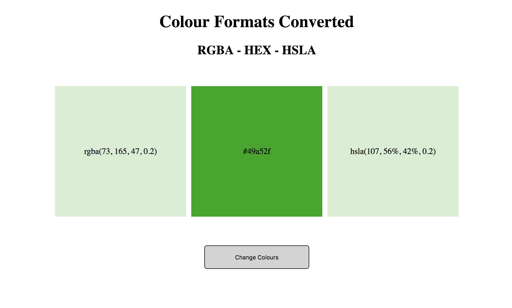

# Colour Converter

  

This project is designed to demonstrate the component-based architecture of React (15.5.4) 
in the development of single-page applications.

The application randomly generates a RGBA colour code and converts this value into HEX and HSLA formats,
presenting these values visually in a web page.

## Technologies Used
- Javascript
- React
- Dev tools (Webpack, ESLint, Babel)

## ⚛️ Installation, Testing and Deployment

#### Install
- Clone or download this repository.
- Run `yarn` or `npm i` to install.

#### Web Server
- Run `yarn start` or `npm start` from the root directory.

#### Build
- Run `yarn build` or `npm build` from the root directory.
